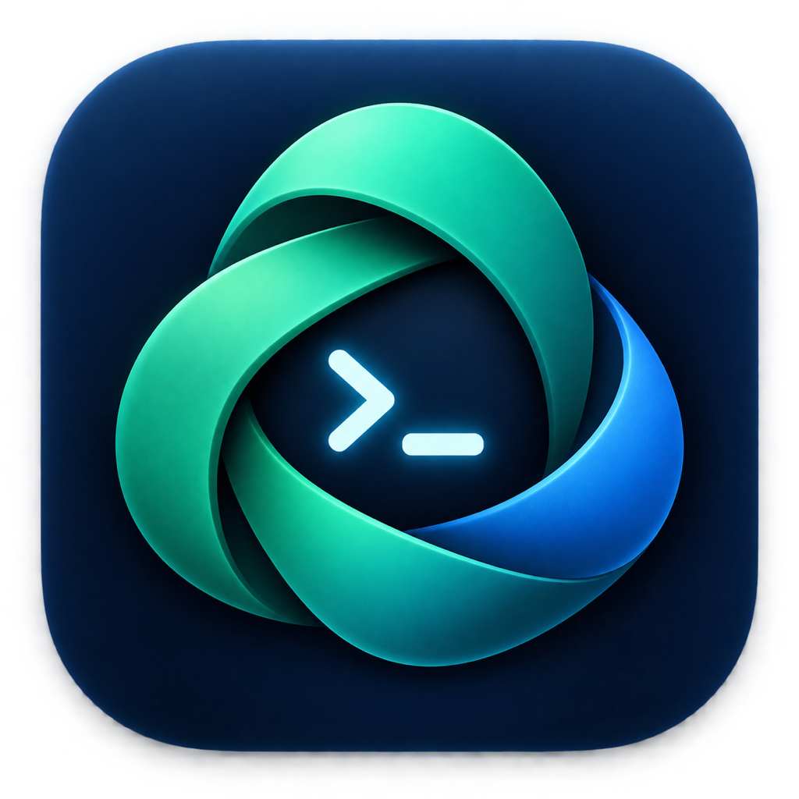
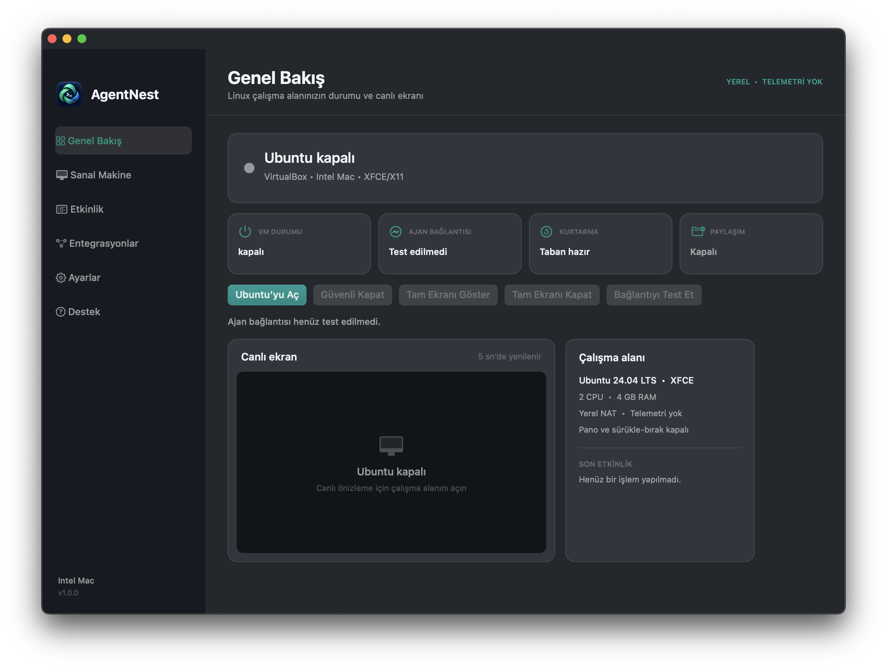
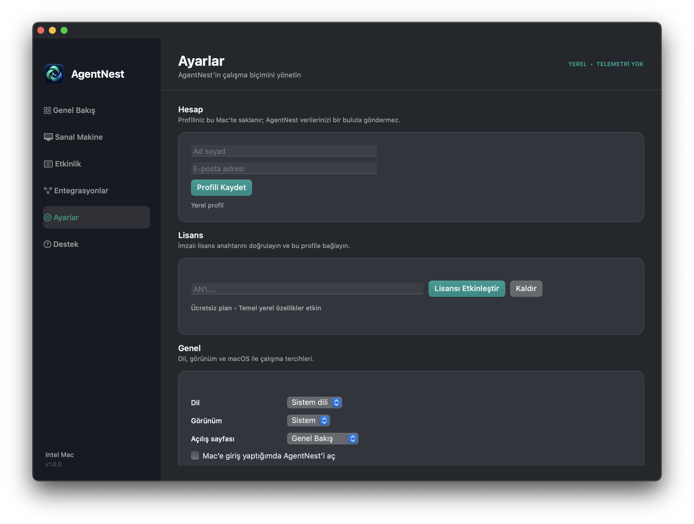
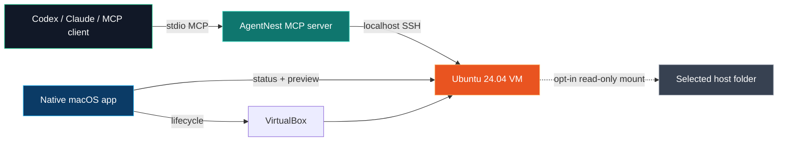

  

<h1 align="center">AgentNest</h1>

  <strong>A separate, local Linux computer for your AI coding agent.</strong>

  Let Codex, Claude, and other MCP-capable agents run, see, click, type, and
  test inside a dedicated Ubuntu workspace—without taking over your Mac.

  
  
  
  
  

> [!NOTE]
> AgentNest is currently a private beta for Intel Macs. This public repository
> is a product showcase; the proprietary source code is maintained privately.

## The idea

AI coding agents become dramatically more useful when they can run and inspect
their own work. AgentNest gives them a dedicated Ubuntu 24.04 desktop with
terminal and visual controls while keeping the normal host workspace isolated
by default.

It combines a native macOS control center, a reproducible VirtualBox workspace,
and a local MCP server into one focused product.

## What AgentNest provides

| Capability | Experience |
| --- | --- |
| Dedicated Linux computer | Ubuntu 24.04 LTS with XFCE/X11 |
| Native Mac control center | Start, stop, preview, diagnose, recover, and configure |
| Agent-native operation | Terminal, screenshots, mouse, keyboard, and checkpoints over MCP |
| Safer host boundary | Clipboard, drag-and-drop, USB, audio, recording, and VRDE disabled |
| Deliberate file access | Host folders are opt-in and read-only |
| Reliable experimentation | Clean baseline restores and named checkpoints |
| Local-first privacy | Loopback-only SSH, local logs, and no product telemetry |
| Broad integrations | Codex, Claude Desktop, editors, CLIs, and standard MCP clients |

## Product tour

<table>
  <tr>
    <td width="50%"></td>
    <td width="50%"></td>
  </tr>
  <tr>
    <td align="center"><strong>Workspace status and live preview</strong></td>
    <td align="center"><strong>Account, license, language, appearance, and privacy</strong></td>
  </tr>
</table>

## Architecture

## Security and privacy by default

- SSH is exposed through a localhost-only VirtualBox NAT forward.
- A dedicated SSH key and private known-hosts file are used.
- Host folders are unavailable until the user explicitly selects one.
- Selected folders are mounted read-only.
- Clipboard, drag-and-drop, USB, audio, recording, and VRDE are disabled.
- Sensitive log values are redacted locally.
- No usage analytics, advertising identifier, or remote crash reporter is used.

Virtualization reduces exposure; it does not make arbitrary code risk-free.
VirtualBox, the guest network, and software installed inside Ubuntu remain part
of the security boundary.

## Current platform

- Intel Mac (`x86_64`)
- macOS 13 or newer
- VirtualBox 7
- Ubuntu 24.04 LTS guest
- Swift/AppKit application
- Dependency-free Python MCP server

Apple Silicon, Windows, cloud VMs, writable host shares, and multi-VM fleets are
not part of the current private beta.

## Status

The native application, VM provisioner, MCP tools, recovery flow, editor
integrations, local account settings, offline signed-license verification, and
Intel DMG builder are implemented and tested on the primary supported host.

Public availability remains gated by Apple Developer ID/notarization, expanded
hardware validation, support policies, and final commercial decisions.

---

  <strong>Local Linux. Deliberate access. A clean nest for your agent.</strong>

